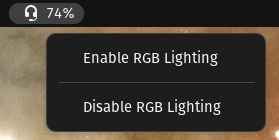

# HeadsetControl Indicator

Gnome extension using headsetcontrol to monitor battery.

I'm a complete JavaScript noob. This was mostly made with the use of ChatGPT. JS purrist, don't read this code, your eyes will (probably) suffer.

[[_TOC_]]

## What is this for

This extension allow monitoring battery and toggling RGB lightning on/off for supported headset.

[Supported devices](https://github.com/Sapd/HeadsetControl#supported-headsets)

## Compatible gnome-shell version

- 45 (WIP, separate branch avaible later)
- 44
- 43
- 42
- 41 (need testing before i enable it)
- 40 (need testing before i enable it)

## Dependencies

You need [HeadsetControl](https://github.com/Sapd/HeadsetControl#building) installed.

Be sure to reload udev rules after installation.

`sudo udevadm control --reload-rules && sudo udevadm trigger`

## How to install

- Clone this repo

`git clone https://gitlab.com/aethernali.live/headsetcontrol-indicator.git`

- cd to the directory

`cd headsetcontrol-indicator`

- Create gnome-shell extensions folder if not already existing

`mkdir -p ~/.local/share/gnome-shell/extensions`

- Copy this extension to the gnome-shell extensions folder

`cp -r headsetcontrolindicator@aethernali.live.gitlab.com ~/.local/share/gnome-shell/extensions/`

- Restart gnome-shell and enable the extension
 
## To-do

- Settings menu (Auto disable / enable RGB through battery threshold, Option to disable low battery notification, data fetch rate)
- Gnome 45

## Credits

[Denis Arnst](https://github.com/Sapd) for HeadsetControl

## License

Released under GPL v3
